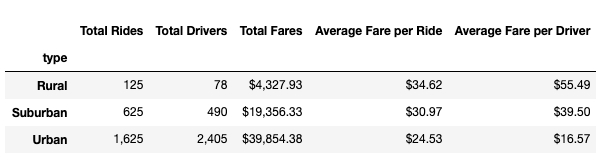
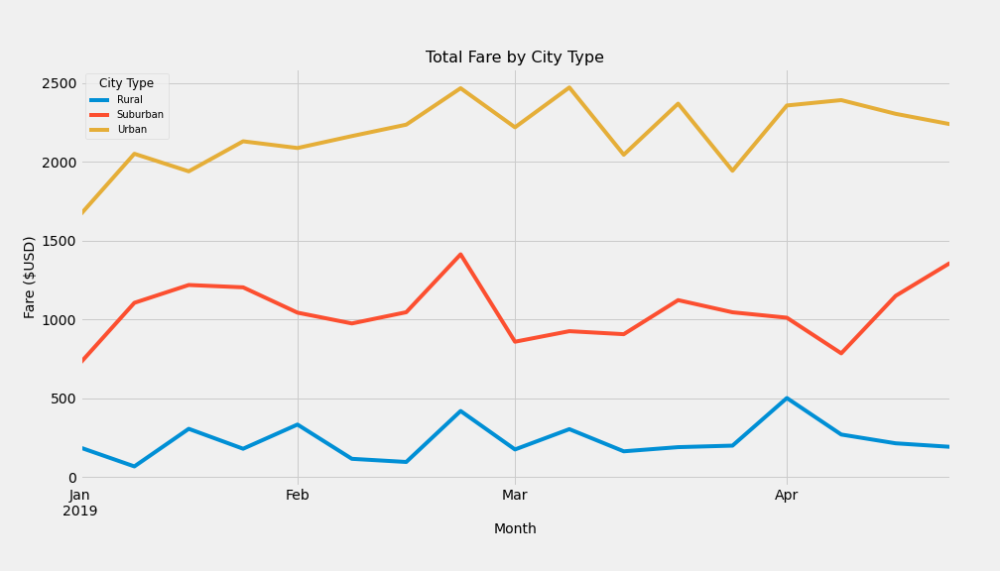

# PyBer_Analysis

# Overview of the Analysis
Performing an exploratory analysis and creating visualizations using rideshare data to help improve access to rideshare services and determine affordability for underserved areas.

# Results
In terms of costs, it appears that riders in rural cities pay on average almost $10 more for PyBer than riders in urban cities. The average fare per ride is about $35 in rural cities whereas the average fare per ride is about $25 in urban cities. Suburban cities' average fare per ride falls just in between - at about $31. While it may not be good news for riders in rural cities, it is a better market for drivers in this type of city. The average fare per driver is about $55 in rural cities, whereas the average fare per driver is about $17 in urban cities. Suburban cities' average fare per driver is about $40.
 

The multiple-line chart "Total Fare by City Type" further supports the PyBer Summary DataFrame by providing trends of total fares in rural, suburban, and urban cities between January 2019 and April 2019. The yellow trend shows how fares in urban cities totaled from around $1,600 to $2,300 from beginning to end during this five-month period. In contrast, the blue trend shows how fares in rural cities totaled around $300 from beginning to end during the same time period. The orange trend shows how the total fares in suruban cities fall in between urban and rural cities: around $700 to $1,300 from beginning to end during this time. The chart further demonstrates similar peak times in all these types of cities. One noteworthy peak in total fares among urban, suburban, and rural cities occurred sometime at the end of February 2019.

# Summary
Business recommendations to the CEO for addressing any disparities among the city type:
 -There is a larger use of PyBer ridesharing in urban cities.
 -There are more drivers in urban cities than rural cities.
 -As a result, the majority of PyBer's revenue occurs in urban cities.
 -On the other hand, the costs for using PyBer is greater among riders in rural cities than urban cities. This could discourage potential riders from using PyBer given the high average fare per ride.
 -Drivers in rural cities are earning more than drivers in urban cities. This could discourage discourage potential drivers from working with PyBer given the low average fare per driver.
 -There is an another opportunity for further analysis to determine other factors that are contributing to the high ride costs in rural cities and low driver fares in urban cities. Perhaps, travel distance is a key factor.
 -Overall, PyBer ridersharing services significantly differs in rural, suruban, and urban cities given the number of rides, drivers, and fares. Data supports that there is higher usage of PyBer ridesharing services in urban cities.
